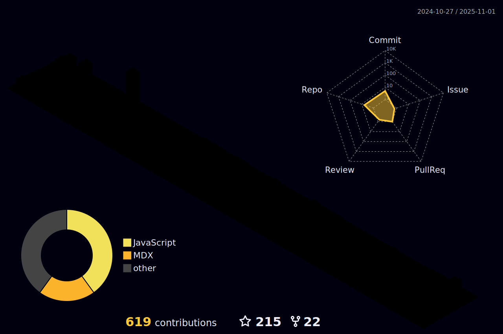

# Hi there,  Nice to see you.  

 

  

 
 
  

### 📑 I'm currently doing front and backend development (Javascript | React.js | Next.js | Python | Django)
- 🌱 I’m currently learning **To be Extroverted**
- 👨🏼‍🤝‍👨🏻 I want to collaborate on open source projects
- 🥅 Goals: Developing an app to be heard in the world and learning virtual reality and artificial intelligence 🤖
- ⚡ Fun fact: I love to running , play chess ♟and cycling 🚴‍♀️
- 💬 You can ask me anything you want to know

#### ⏲ What we are doing now:
- 🚀 I'm developing a project for Teknofest, i keep improving myself 📃.
- 👨🏼‍🤝‍👨🏻 I'm developing an app with my team, 
- 💻 I also work as a FreeLancer.
 

<b>Connect with me:</b>

<p">

<b> Languages and Tools:</b>
  
[][vsCode]
[][git]
[][github]
[][python]

[][HTML]
[][js]
[][react]

[][linux]   

    

 

[react]: https://tr.reactjs.org/
[vsCode]: https://code.visualstudio.com/
[git]: https://git-scm.com/
[github]: https://github.com/enes9103
[python]: https://www.python.org/
[js]: https://www.javascript.com/
[linux]: https://www.linux.org/
[HTML]: https://www.w3schools.com/html/

  

<b>Github Stats :</b>

📫 <b>How to reach me:</b>

 

  
  
 🌱 <b>Support:</b>
  

 

 
<!--  -->
